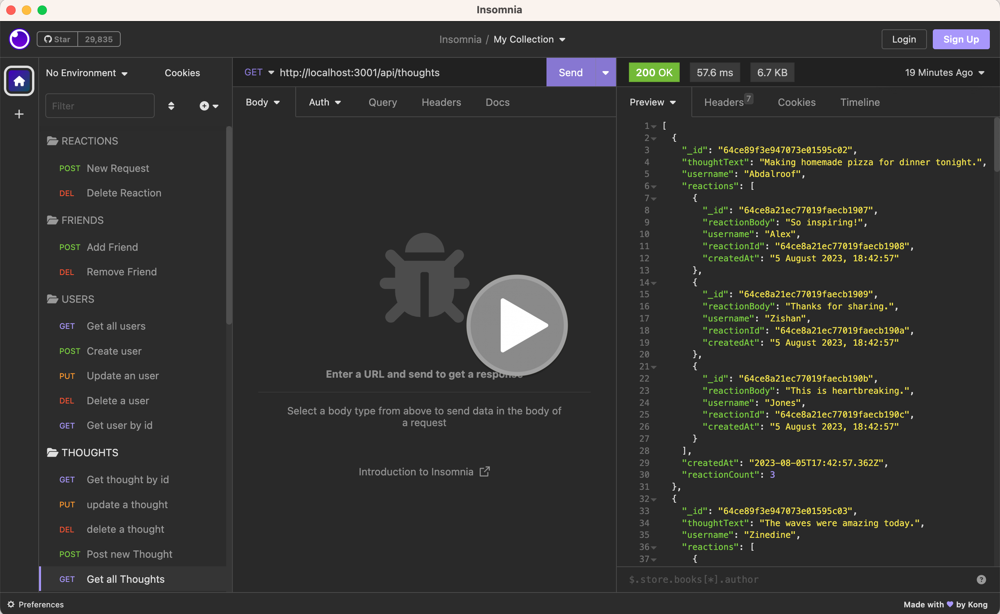

# Mongoose-Social

This is a Social Networking API using Mongoose, and MongoDB.
it is an API where users can share their thoughts, react to friends’ thoughts, and create a friend list, add friends and remove friends and so on.


## User Story

```md
AS A social media startup
I WANT an API for my social network that uses a NoSQL database
SO THAT my website can handle large amounts of unstructured data
```

## Acceptance Criteria

```md
GIVEN a social network API
WHEN I enter the command to invoke the application
THEN my server is started and the Mongoose models are synced to the MongoDB database
WHEN I open API GET routes in Insomnia for users and thoughts
THEN the data for each of these routes is displayed in a formatted JSON
WHEN I test API POST, PUT, and DELETE routes in Insomnia
THEN I am able to successfully create, update, and delete users and thoughts in my database
WHEN I test API POST and DELETE routes in Insomnia
THEN I am able to successfully create and delete reactions to thoughts and add and remove friends to a user’s friend list
```


## Installation
  
to install for running in localhost, just exceute the following:

  ```md
  npm i 
  ```

that would install the following package:
1.  Express.  It is a fast, and minimalist web framework for Node.js that simplifies the process of building web applications and APIs by providing a robust set of features for routing, middleware, template engines, and more.

2.  Mongoose. It is a robust, schema-based Object Data Modeling (ODM) library for MongoDB that provides a straightforward and schema-based solution to model your application data.


## Technologies Used

This application is built using the following technologies:

- **JavaScript**: Programming language for adding interactivity and dynamic content.
- **NodeJS**: an open-source, cross-platform, JavaScript runtime environment that executes JavaScript code outside of a web browser.
- **MongoDB**: It is document-oriented database designed for ease of development and scaling, providing high performance, high availability, and easy scalability by working with schema-free JSON-like documents.
- **Express**: A minimal and flexible Node.js web application framework that provides a robust set of features for web and mobile applications, such as routing, and middleware setup.

## Usage

The user should clone the repository and run 'npm i' to install the following: 
- express
- mongoose

database setup:
run 'npm run seed' to setup the seeds data

for localhost:
then run 'npm run start' to invoke the online store backend.


the walkthrough video is below:

[](https://drive.google.com/file/d/1ROyUaJ3hP6wJRt5OywooCP3SBexx2dLT)


## Features

The application is capable of the API functionality social network.
Include the all the Restful CRUD operations on user/thought/friend and reaction:

1.  Get all/Get any
2.  Post
3.  Put
4.  Delete
for user/thought.

and 

1. Post
2. Delete 
for friends and reactions.


## Tests

Testing done on:

User - CRUD operations:
1.  Create a new user
2.  Get all users
3.  Get user by id
4.  Update a user by id
5.  Delete a user by id

Thought - CRUD operations:
1.  Create a thought
2.  Get all thoughts
3.  Get a particular thought by id
4.  Update a thought by id
5.  Delete a thought by id

Friend: 
1.  Add Friend by id
2.  Remove Friend by id

Reaction:
1.  Add Reaction on a thought
2.  Remvoe Reaction on a thought


## Resources

```md
Link to Walkthrough Video:

https://drive.google.com/file/d/1ROyUaJ3hP6wJRt5OywooCP3SBexx2dLT

Link to GitHub repo:

https://github.com/percivalho/Mongoose-Social.git

```

## License 


## Credits and Copyright 
&copy; Copyright 2023 - Present. Percival Ho